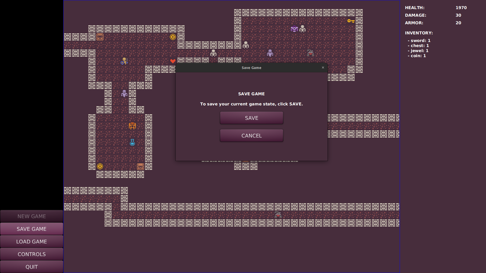
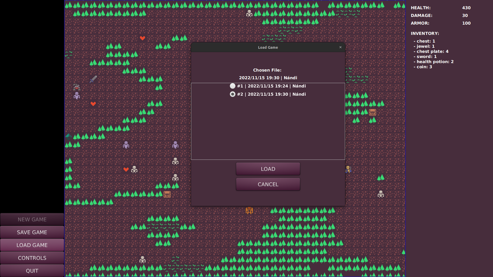
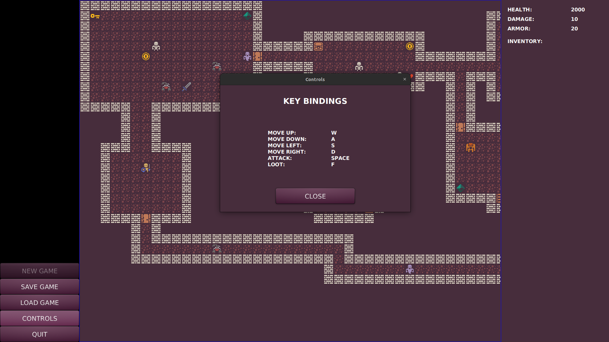
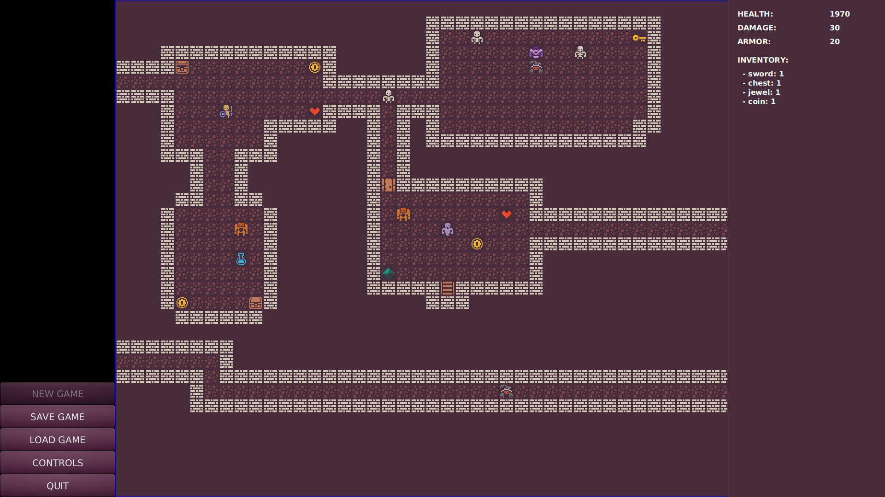
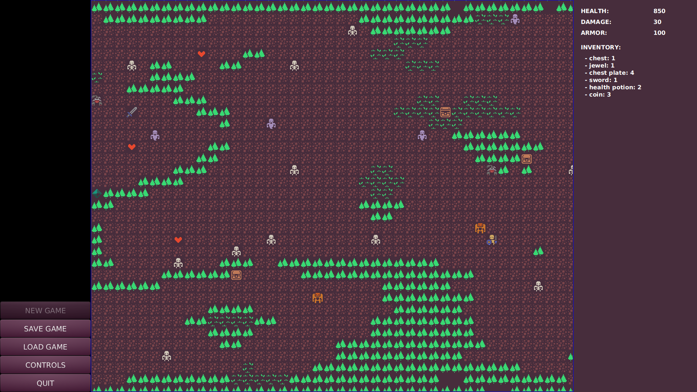

# Rogue-like Game

## Project Description

A rogue-like game written in Java, using the JavaFX platform and a PostgreSQL database to store the current game state.

This was an enjoyable, two-sprint project we had to implement in a matter of two weeks at school to practice OOP concepts and programming in Java.

## Game Features

- Save, load and pause game
- Game menu
- Player-tracking camera movement
- Different enemy types (unique behaviors, movements and stats; actively attack player)
- Multiple maps
- Player inventory
- Restriction of movement (player cannot run into walls and monsters)
- Pick up objects that influence player stats (potions, armors, keys to open doors)

## Maps

## Technologies

- Java
- JavaFX
- CSS

## Future development

- New game option
- More maps
- More sophisticated enemy movement
- New enemy types
- End game level (boss fight)

## Wins & Challenges

### Wins
- Got more practice in OOP.
- Understood design patterns better (e.g. layer separation).
- Got more familiar with the Data Access Object design pattern.
- Had great teamwork and project experience.
- Got some experience with JavaFX, which is an open source client application platform for desktop, mobile and embedded systems built on Java.

### Challenges
- Figure out project structure and how separate layers should communicate with each other.
- Working with JavaFX.
- Designing maps.
